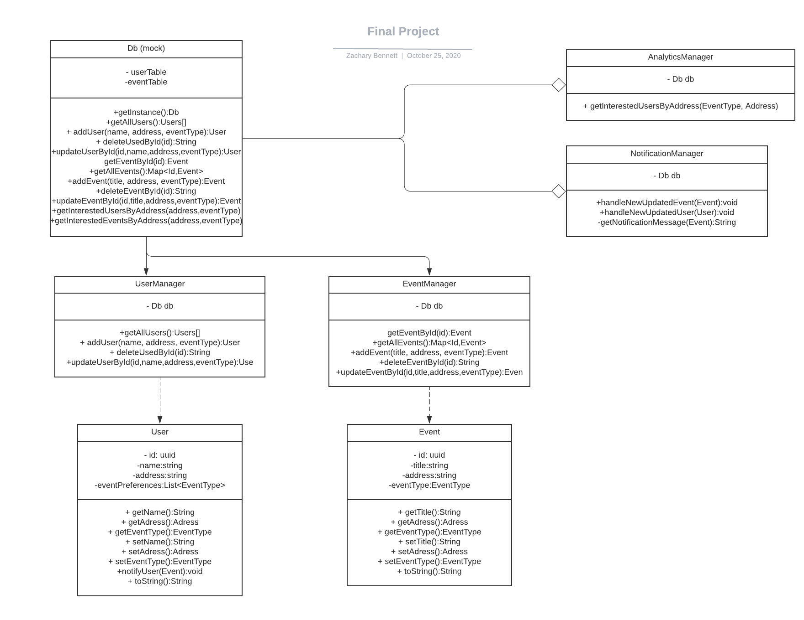

##Classes Breakdown:
1. Db: Source of truth for all data. Operations: getInstance, getAllUsers, addUser, deleteUserById, updateUserById, getEventById, addEvent, deleteEventById, updateEventById, getInterestedUsersByAddress, getInteresteEventsByAddress
2. User. Represents a single user in the system. Getters for basic data. Operations: getName, getAddress, getEventType, setName, setAddress, setEventType, notifyUser
3. Event. Represents a single event in teh system. Getters for basic data. Operations: getTitle, getAddress, getEventType, setTitle, setAddress, setEventType,
4. UserManager: Handles all CRUD operations for the user class. Connects with DB (param). Operations: getAllUsers, addUser, deleteUserById, updateUserById,
5. EventManager: Handles all CRUD operations for the Event class. Connects with DB (param). Operations: getEventById, addEvent, deleteEventById, updateEventById,
6. AnalyticsManager: Gets analytics for the client, connects to the UserManager and EventManager. Operations: getInterestedUsersByAddress. 
7. NotificationManager: Handles the notification logic, connects to the Db. Operations: getInterestedUsersByAddress. 

##Database Tables:
UsersTable. UUID id, String name, String address, List<EventType> interestedEventTypes

EventsTable. UUID id, String title, String address, EventType eventType

##Testing Instructions:
Start up the server with `gradlew bootRun`
Make the following curl calls
```
curl --location --request POST 'http://localhost:8080/users' \
--header 'Content-Type: application/json' \
--data-raw '{"name": "Bob", "address": "Miami", "eventType": "education, charity"}'
```
```
curl --location --request POST 'http://localhost:8080/events' \
--header 'Content-Type: application/json' \
--data-raw '{"title": "Charity Event Miami", "address": "Miami", "eventType": "charity"}'
```
At this point, you should see a "notification" to Bob about a charity event in Miami

```
curl --location --request POST 'http://localhost:8080/events' \
--header 'Content-Type: application/json' \
--data-raw '{"title": "Music Event Event", "address": "Atlanta", "eventType": "music"}'
```
```
curl --location --request POST 'http://localhost:8080/users' \
--header 'Content-Type: application/json' \
--data-raw '{"name": "Sally", "address": "Atlanta", "eventType": "music"}'
```
At this point, you should see a "notification" to Sally about a music event in Atlanta

```
curl --location --request GET 'http://localhost:8080/analytics?address=atlanta&eventType=music'
```
You should see that one user is interested in music events in atlanta

## Other API Calls
/users:
    POST:
        Params:{name, address, eventType:[]}
        returns created user
    GET: 
        Returns specific user if you pass the id as the path param, otherwise returns all users
    PUT: 
        Params:{id, name, address, eventType:[]}
        returns the updated user
    DELETE
        Params: path param of user id
        Returns string confirm user deletion 

/events
    POST
        {title: address, eventType}
    GET: 
        Returns specific event if you pass the id as the path param, otherwise returns all event
    PUT: 
    Params:{id, name, address, eventType:[]}
            returns the updated event
    DELETE
            Params: path param of event id
            Returns string confirm event deletion
/analytics:
    GET
        query params: address=atlanta&eventType=music
            returns number of interested users